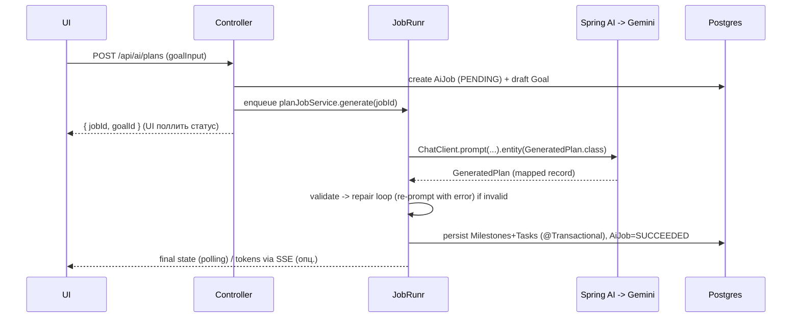

# ТЗ — «Questline»: AI-powered трекер цілей зі стріками (Java edition)

> **Назва:** `Questline` (фінальна).
> **Тип:** веб-застосунок. **Старт:** single-user (для себе), архітектура готова до multi-user / SaaS.
> **Стек:** Java + Spring + React. **Рантайм-AI:** безкоштовний хмарний LLM (Gemini free tier) через Spring AI.
> **Призначення документа:** повне ТЗ, яке можна згодувати Claude Code і будувати поетапно.
>
> Пояснення — українською, технічні ідентифікатори (сутності, поля, енам, роути, код) — англійською.
>
> **Дві різні «AI» (не плутати):** *Claude Code* — інструмент розробки (ним будуємо). *Рантайм-AI* («Questline») — безкоштовний LLM усередині застосунку, що декомпозує цілі. Цей документ описує рантайм-AI.

---

## 0. Огляд (Vision)

**Проблема.** Є велика ціль («стати senior за рік»), але немає системи, яка декомпозує її на щоденні кроки, тримає фокус і не дає кинути.

**Рішення.** Веб-сервіс, де користувач або (а) формулює ціль і AI-рушій будує роадмапу, або (б) завантажує готову роадмапу і AI її парсить у структуроване дерево. Дерево розкладається на маленькі задачі на кожен день. Прогрес гейміфіковано: стріки, XP, рівні, бейджі, heatmap.

**Головний користувач (v1):** сам автор. **Метрика успіху MVP:** автор реально користується щодня ≥ 2 тижні поспіль і доводить хоча б один milestone до кінця.

**Один рядок:** *«Завантаж або сформулюй ціль → AI декомпозує її в дерево задач → закривай по кілька щодня й тримай стрік.»*

---

## 1. Ключові концепти (Glossary)

| Концепт | Опис |
|---|---|
| **Goal** | Велика ціль. Має context («де я зараз»), target («ким хочу стати»), дедлайн. |
| **Milestone** | Етап/рівень усередині цілі (напр. «Concurrency», «System Design»). |
| **Task** | Атомарний крок, який реально зробити за один підхід. Може мати subtasks. |
| **Topic** | Тег теми на задачах (для трекінгу «що я пройшов»). |
| **Plan / Roadmap** | Структуроване дерево `Goal → Milestone → Task`, яке згенерував/розпарсив AI. |
| **AI Engine («Questline»)** | Шар поверх Spring AI: генерація плану, парсинг, докомпозиція, перепланування. |
| **ActivityDay** | Запис за локальний день: скільки задач закрито, чи виконано денну ціль. |
| **Streak** | Серія послідовних днів, у які виконано денну ціль. |
| **Daily capacity** | Скільки хвилин/день користувач готовий приділяти (для реалістичного плану). |

---

## 2. Користувацькі сценарії (User flows)

### Flow A — Згенерувати план з цілі (AI)
1. Користувач вводить: `context`, `target`, `timeframe`/`targetDate`, `weeklyCapacityMinutes`.
2. AI пропонує роадмапу (milestones + чорнові задачі), **стрімиться** в UI.
3. Користувач **уточнює в чаті**: «додай більше про system design», «X я вже знаю — прибери», «зроби 3 місяці замість 6».
4. На «Прийняти» AI віддає фінальний **structured output**, який зберігається як `Goal/Milestone/Task`.

### Flow B — Імпорт готової роадмапи
1. Вставляє текст роадмапи або завантажує файл (`.md`/`.txt`/`.pdf`).
2. AI парсить → дерево → користувач рев'юить/править → зберігаємо.

### Flow C — Докомпозувати вузол
1. На milestone/задачі кнопка «Розбити» → AI генерує subtasks для вузла (з контекстом усієї цілі).

### Flow D — Денне планування
1. Екран «Сьогодні» показує задачі з `scheduledFor == today`.
2. MVP: користувач сам тягне задачі в «Сьогодні».
3. Phase 2: «Спланувати день» — правила/AI підбирають набір під `dailyCapacityMinutes` + дедлайн.

### Flow E — Адаптивне перепланування (Phase 2)
1. Якщо відстаєш/випереджаєш — AI перебалансовує залишок під дедлайн і денну ємність.

### Flow F — Щоденна петля (core loop)
Зайшов → бачиш сьогоднішні задачі + стрік → закрив задачі → XP, стрік +1, можливо бейдж → heatmap зафарбувався → завтра нагадування.

### Onboarding
Реєстрація → таймзона + денна ємність → перша ціль (Flow A або B) → перша задача на «Сьогодні».

---

## 3. Функціональні вимоги (Features)

Фази: **[MVP]** = Phase 1, **[v1]** = Phase 2, **[v2]** = Phase 3.

### 3.1 Auth & профіль
- **[MVP]** Реєстрація/вхід: Google OAuth2 (Spring Security) + JWT для API.
- **[MVP]** Профіль: ім'я, аватар, **timezone (IANA)**, `dailyCapacityMinutes`, `dailyTaskGoal`.
- **[v2]** Видалення акаунта + експорт даних.

### 3.2 Goal management
- **[MVP]** CRUD цілей: title, description, context, target, targetDate, status.
- **[MVP]** Статуси: `ACTIVE | PAUSED | COMPLETED | ARCHIVED`.
- **[MVP]** Прогрес цілі (% закритих задач) — derived, кешується в `Goal.progress`.
- *Acceptance:* створення цілі вручну без AI має працювати завжди (AI — опційний шар поверх).

### 3.3 AI-рушій декомпозиції («Questline»)
- **[MVP]** Flow A: генерація плану зі **стрімінгом** і **structured output**.
- **[MVP]** Уточнення плану в чаті перед збереженням (зберігаємо `AiMessage`).
- **[MVP]** Збереження дерева в одній транзакції.
- **[v1]** Flow B (парсинг), Flow C (докомпозиція), Flow E (перепланування).
- *Acceptance (важливо):*
  - LLM-виклик іде як **background job** (JobRunr), не блокує HTTP-запит.
  - Вихід мапиться в Java-record і **валідовується**; якщо невалідний — **repair-loop** (повторний промпт з помилкою), максимум N спроб.
  - Якщо фейл — job у `FAILED`, користувач бачить зрозумілу помилку + «спробувати ще».
  - Зберігаються токени/латентність на кожну job (а для платних провайдерів — і вартість).

### 3.4 Roadmap / задачі
- **[MVP]** Деревовидний перегляд `Goal → Milestone → Task (→ Subtask)`.
- **[MVP]** Task CRUD: title, description, estimateMinutes, status, scheduledFor, resources[], notes.
- **[MVP]** Статуси: `TODO | IN_PROGRESS | DONE | SKIPPED`.
- **[MVP]** Drag-and-drop порядку (`order`).
- **[v1]** Subtasks, масові дії.

### 3.5 Планування й екран «Сьогодні»
- **[MVP]** «Сьогодні»: задачі з `scheduledFor == today (user tz)`; додати/прибрати/перенести.
- **[v1]** «Спланувати день» (автопідбір під ємність+дедлайн); тижневий вью.

### 3.6 Гейміфікація
- **[MVP]** Стрік (current/longest), денна ціль, базовий XP, heatmap (365 днів).
- **[v1]** Рівні, бейджі/achievements, streak freezes, сторінка статистики.
- Точні правила — розділ 10.

### 3.7 Трекінг тем (Topics)
- **[MVP]** Topic-теги на задачах (free-text, автостворення `Topic`).
- **[v1]** Вью «Пройдені теми» (% завершення); фільтр за topic.

### 3.8 Нагадування
- **[v1]** Email-нагадування ввечері, якщо денну ціль ще не виконано; «стрік під загрозою».
- **[v2]** Web push.

### 3.9 Multi-user / SaaS
- **[v2]** Відкрита реєстрація, повний onboarding, лендинг.
- **[v2]** Біллінг (Stripe), плани, ліміти AI-генерацій.
- **[v2]** Шеринг роадмап (публічні шаблони), опційно лідерборди.
- **[v2]** Адмінка, аудит, rate-limit hardening.

---

## 4. Нефункціональні вимоги (NFR)

- **Multi-tenancy:** кожна доменна сутність має `userId`; **усі** запити скоупляться по сесійному юзеру (через Spring Security `Authentication` + сервісний шар). Жодного запиту без власника. (Phase 3: Postgres RLS як другий рубіж.)
- **Таймзони/стріки (критично):** «сьогодні» рахується в `user.timezone`; межа = локальна північ. Не покладатись на UTC-дату.
- **Надійність LLM:** усі AI-операції — durable job-и (JobRunr), ідемпотентні, з repair-loop. Spring AI дає вбудований retry для транзієнтних помилок API. Жодного «білого екрана» при фейлі моделі.
- **Безкоштовність AI:** дефолт-провайдер не повинен коштувати грошей (Gemini free tier). Абстракція дозволяє свопнути провайдера без зміни доменного коду.
- **Performance:** списки (дерево, «Сьогодні») — пагінація/lazy-loading; цільовий час відповіді ключових ендпоінтів < 500ms (без AI-джоб).
- **Безпека:** Bean Validation на всіх входах; secrets лише в env/`application.yml` з env-плейсхолдерами; Spring Security headers/CSRF за замовч.; provider-ключі (якщо хмарний AI) — лише на сервері.
- **Observability:** Spring Boot Actuator + Micrometer; структуровані логи джоб; (опц.) Sentry Java SDK; продуктові події (task_completed, plan_generated, streak_broken).
- **Тести:** доменна логіка (стрік, XP, прогрес, валідація AI-виходу) — unit; ключові флоу — integration/e2e.

---

## 5. Архітектура

### 5.1 Загальна форма (модульний моноліт)
```
[ React + TS (Vite) SPA ]   (альтернатива: Thymeleaf + HTMX)
        |  REST + JWT (JSON)
        v
[ @RestController (controllers) ]   тонкі: валідація + виклик сервісів
        v
[ Service layer ]  --->  [ AI Engine module (Spring AI) ]  ---> Gemini API (free)
   (goal, task, streak,        (ChatClient, structured
    gamification, schedule)     output, prompts, repair)
        |                            |
        |                            v
        |                     [ JobRunr jobs ] (durable async, recurring crons)
        v
[ Repository layer (Spring Data JPA) ] ---> PostgreSQL
                                            (Flyway migrations)
```

**Пакети (чисті межі):**
- `web/` — `@RestController` + DTO (records) + Bean Validation.
- `service/` — бізнес-логіка (нічого про HTTP/JPA назовні).
- `repository/` — Spring Data JPA інтерфейси (єдине місце доступу до даних).
- `ai/` — рушій «Questline»: `ChatClient`-конфіг, промпти, output-records, парсинг, repair-loop.
- `jobs/` — JobRunr job-сервіси та recurring задачі.
- `domain/` — JPA-сутності + енами.
- `security/` — Spring Security, JWT, OAuth2.
- `common/` — утиліти (таймзони, XP-формули), exception handling (`@ControllerAdvice`).

> **Альтернатива фронту:** Thymeleaf + HTMX (суто Java, менше JS) — тоді замість REST+SPA рендеримо сторінки на сервері, інтерактив через HTMX-фрагменти. Контролери стають `@Controller` (повертають view), частина ендпоінтів — HTMX-партіали. Решта (service/repo/ai/jobs/domain) не змінюється.

### 5.2 Потік AI-генерації плану


**Стрімінг у MVP:** простіше — JobRunr job + поллінг статусу `AiJob` кожні 1–2с. Опційно — стрімінг токенів через Spring AI `stream()` + `SseEmitter`. Не ускладнювати передчасно.

---

## 6. Стек (конкретика, актуально на 2026)

| Шар | Вибір | Нащо |
|---|---|---|
| Мова | **Java 21 LTS** (або 25 LTS) | сучасна Java: records, pattern matching, virtual threads |
| Фреймворк | **Spring Boot 4.0** (Framework 7, Jakarta EE 11) | індустрійний стандарт; greenfield-вибір (3.5 EOL 30.06.2026) |
| Web | **Spring Web (REST)** | `@RestController`, API versioning |
| Дані | **Spring Data JPA (Hibernate)** | репозиторії, мапінг |
| Міграції | **Flyway** | версіоновані DDL (альтернатива — Liquibase) |
| БД | **PostgreSQL** | надійно, реляційно, JSON-колонки |
| Auth | **Spring Security** + Google OAuth2 + **JWT** | свій auth, сеньйорський скіл |
| **AI** | **Spring AI 2.0** | абстракція над 20+ провайдерами, structured output у records, tool calling, retry |
| AI-провайдер | **Google Gemini** free tier (`gemini-2.5-flash`) | безкоштовно, без кредитки; ключ з Google AI Studio |
| Async-джоби | **JobRunr** | durable background-джоби + recurring crons, DB-backed, безкоштовно |
| Валідація | **Jakarta Bean Validation** | `@Valid` на DTO + валідація AI-виходу |
| Тести | **JUnit 5 + Mockito + Testcontainers + RestAssured** | unit + integration з реальним Postgres |
| Обсервабіліті | **Actuator + Micrometer** (+ Sentry опц.) | метрики, health, помилки |
| Build | **Gradle** (Kotlin DSL) | сучасно (альтернатива — Maven) |
| Boilerplate | **Lombok** (опц.) для сутностей | менше гетерів/сетерів |
| Фронт | **React + TS (Vite)** | багатий інтерактив (альтернатива — Thymeleaf + HTMX) |
| Деплой | локально (Docker) або **Railway/Render/Fly.io** free tier + Neon Postgres | див. розділ 12 |

> Модель і провайдер — у `application.yml` через env (`GEMINI_API_KEY`, назва моделі). Не хардкодити. Беремо безкоштовний ключ з **Google AI Studio**, НЕ Vertex AI (той вимагає білінгу в GCP).
>
> **Spring AI 2.0 на старті — це RC** (GA ще не вийшов станом на червень 2026): пінимо BOM на найновіший RC, бампимо на GA коли вийде. Рушій ховаємо за **власним інтерфейсом** у `ai/` (напр. `PlanGenerator`, що повертає наші record-и) з імплементацією на Spring AI. Сервіси залежать від інтерфейсу, не від `ChatClient` — щоб RC→GA-зміни (чи можливий своп на LangChain4j / власний Gemini-клієнт) лишались в одному модулі.

---

## 7. Модель даних (JPA entities + Flyway)

> DDL живе у Flyway-міграціях (`db/migration/V1__init.sql`, ...). Сутності мапляться на нього. UUID-ключі. `resources` — JSON-колонка (`@JdbcTypeCode(SqlTypes.JSON)`). Гетери/сетери опущено (Lombok `@Getter/@Setter`).

```java
// ---------- enums ----------
public enum GoalSource     { AI_GENERATED, IMPORTED }
public enum GoalStatus     { ACTIVE, PAUSED, COMPLETED, ARCHIVED }
public enum MilestoneStatus{ NOT_STARTED, IN_PROGRESS, DONE }
public enum TaskStatus     { TODO, IN_PROGRESS, DONE, SKIPPED }
public enum AiJobType      { GENERATE_PLAN, PARSE_ROADMAP, DECOMPOSE_TASK, REPLAN, DAILY_PLAN }
public enum AiJobStatus    { PENDING, RUNNING, SUCCEEDED, FAILED }

// ---------- core ----------
@Entity @Table(name = "users")
public class User {
  @Id @GeneratedValue UUID id;
  @Column(unique = true, nullable = false) String email;
  String name;
  String image;
  @Column(nullable = false) String timezone = "Europe/Kyiv"; // IANA — критично для стріків
  int dailyCapacityMinutes = 120;
  int dailyTaskGoal = 1;          // скільки задач/день зараховує стрік
  long xpTotal = 0;
  Instant createdAt;
  Instant updatedAt;
  // @OneToMany goals, tasks; @OneToOne streak; ...
}

@Entity @Table(name = "goals")
public class Goal {
  @Id @GeneratedValue UUID id;
  @ManyToOne(optional = false) User user;
  @Column(nullable = false) String title;
  @Column(columnDefinition = "text") String description;
  @Column(columnDefinition = "text") String context;  // "де я зараз"
  @Column(columnDefinition = "text") String target;   // "ким хочу стати"
  @Enumerated(EnumType.STRING) GoalSource source = GoalSource.AI_GENERATED;
  LocalDate targetDate;
  @Enumerated(EnumType.STRING) GoalStatus status = GoalStatus.ACTIVE;
  double progress = 0;            // 0..1, derived cache
  Instant createdAt;
  Instant updatedAt;
  @OneToMany(mappedBy = "goal", cascade = ALL, orphanRemoval = true) List<Milestone> milestones;
}

@Entity @Table(name = "milestones")
public class Milestone {
  @Id @GeneratedValue UUID id;
  @ManyToOne(optional = false) Goal goal;
  @Column(nullable = false) String title;
  @Column(columnDefinition = "text") String description;
  int orderIndex;
  @Enumerated(EnumType.STRING) MilestoneStatus status = MilestoneStatus.NOT_STARTED;
  double progress = 0;
  LocalDate targetDate;
  @OneToMany(mappedBy = "milestone", cascade = ALL, orphanRemoval = true) List<Task> tasks;
}

@Entity @Table(name = "tasks",
  indexes = { @Index(columnList = "user_id, scheduled_for"), @Index(columnList = "milestone_id, order_index") })
public class Task {
  @Id @GeneratedValue UUID id;
  @ManyToOne(optional = false) User user;
  @ManyToOne(optional = false) Goal goal;
  @ManyToOne Milestone milestone;
  @ManyToOne Task parentTask;                 // subtasks
  @OneToMany(mappedBy = "parentTask") List<Task> subtasks;

  @Column(nullable = false) String title;
  @Column(columnDefinition = "text") String description;
  Integer estimateMinutes;
  int orderIndex = 0;
  @Enumerated(EnumType.STRING) TaskStatus status = TaskStatus.TODO;
  LocalDate scheduledFor;                     // день, на який заплановано
  Instant completedAt;
  @JdbcTypeCode(SqlTypes.JSON) List<ResourceLink> resources; // [{title,url}]
  @Column(columnDefinition = "text") String notes;
  @ManyToMany List<Topic> topics;
  Instant createdAt;
  Instant updatedAt;
}
// record ResourceLink(String title, String url) {}

@Entity @Table(name = "topics",
  uniqueConstraints = @UniqueConstraint(columnNames = {"user_id","slug"}))
public class Topic {
  @Id @GeneratedValue UUID id;
  @ManyToOne(optional = false) User user;
  @Column(nullable = false) String name;
  @Column(nullable = false) String slug;
}

@Entity @Table(name = "activity_days",
  uniqueConstraints = @UniqueConstraint(columnNames = {"user_id","date"}))
public class ActivityDay {
  @Id @GeneratedValue UUID id;
  @ManyToOne(optional = false) User user;
  @Column(nullable = false) LocalDate date;   // локальна дата юзера
  int tasksCompleted = 0;
  int minutesSpent = 0;
  int xpEarned = 0;
  boolean goalMet = false;                    // чи виконано денну ціль -> зараховує стрік
}

@Entity @Table(name = "streaks")
public class Streak {
  @Id UUID userId;                            // @MapsId до User
  @OneToOne(optional = false) @MapsId User user;
  int current = 0;
  int longest = 0;
  LocalDate lastActiveDate;
  int freezesAvailable = 0;
  Instant updatedAt;
}

@Entity @Table(name = "achievements")
public class Achievement {
  @Id @GeneratedValue UUID id;
  @Column(unique = true, nullable = false) String code; // STREAK_7, FIRST_GOAL, ...
  String title;
  String description;
  String icon;
}

@Entity @Table(name = "user_achievements")
public class UserAchievement {
  @EmbeddedId UserAchievementId id;           // (userId, achievementId)
  @ManyToOne @MapsId("userId") User user;
  @ManyToOne @MapsId("achievementId") Achievement achievement;
  Instant unlockedAt;
}

@Entity @Table(name = "ai_jobs",
  indexes = @Index(columnList = "user_id, type, status"))
public class AiJob {
  @Id @GeneratedValue UUID id;
  @ManyToOne(optional = false) User user;
  @ManyToOne Goal goal;
  @Enumerated(EnumType.STRING) AiJobType type;
  @Enumerated(EnumType.STRING) AiJobStatus status = AiJobStatus.PENDING;
  @JdbcTypeCode(SqlTypes.JSON) Map<String,Object> input;
  @JdbcTypeCode(SqlTypes.JSON) Map<String,Object> output;
  @Column(columnDefinition = "text") String error;
  Integer tokensInput;
  Integer tokensOutput;
  int attempts = 0;
  Instant createdAt;
  Instant finishedAt;
}

@Entity @Table(name = "ai_messages")
public class AiMessage {
  @Id @GeneratedValue UUID id;
  @ManyToOne Goal goal;
  UUID jobId;
  String role;                                // "user" | "assistant"
  @Column(columnDefinition = "text") String content;
  Instant createdAt;
}
```

---

## 8. API (REST контракти)

Стиль: тонкі `@RestController`, вхід/вихід — DTO-records з Bean Validation; бізнес-логіка у сервісах. `userId` береться з `Authentication` (JWT), ніколи з тіла запиту.

```java
// DTO (records) + validation
public record GoalInput(
    @NotBlank String context,
    @NotBlank String target,
    @Future LocalDate targetDate,           // nullable ок
    @Positive Integer weeklyCapacityMinutes
) {}

// AI structured output (Spring AI мапить сюди)
public record GeneratedPlan(String summary, List<MilestoneNode> milestones) {}
public record MilestoneNode(String title, String description, List<TaskNode> tasks) {}
public record TaskNode(String title, String description, Integer estimateMinutes,
                       List<String> topics, List<TaskNode> subtasks) {}
```

| Метод | Шлях | Опис |
|---|---|---|
| GET | `/api/me` | профіль |
| PATCH | `/api/me/settings` | timezone, dailyCapacityMinutes, dailyTaskGoal |
| GET | `/api/goals?status=` | список цілей |
| POST | `/api/goals` | створити ціль вручну |
| GET | `/api/goals/{id}` | ціль із деревом |
| PATCH | `/api/goals/{id}` | оновити |
| POST | `/api/goals/{id}/archive` | архівувати |
| POST | `/api/ai/plans` | **Flow A**: generatePlan → `{ jobId, goalId }` |
| POST | `/api/ai/plans/{goalId}/refine` | чат-уточнення → `{ jobId }` |
| POST | `/api/ai/plans/{goalId}/accept` | persist дерева → `Goal` |
| POST | `/api/ai/roadmaps/parse` | **Flow B**: текст/файл → `{ jobId }` |
| POST | `/api/ai/tasks/{taskId}/decompose` | **Flow C** → `{ jobId }` |
| POST | `/api/ai/goals/{goalId}/replan` | **Flow E** → `{ jobId }` |
| GET | `/api/ai/jobs/{jobId}` | статус джоби (поллінг) |
| POST | `/api/tasks` | створити задачу |
| PATCH | `/api/tasks/{id}` | оновити |
| PATCH | `/api/tasks/{id}/status` | змінити статус (тут тригериться gamification) |
| PATCH | `/api/tasks/{id}/schedule` | запланувати на дату / зняти |
| POST | `/api/tasks/reorder` | новий порядок `{ ids: [] }` |
| GET | `/api/tasks/today` | задачі на сьогодні (user tz) |
| DELETE | `/api/tasks/{id}` | видалити |
| GET | `/api/stats/streak` | поточний/найдовший стрік |
| GET | `/api/stats/heatmap?from&to` | `[{date,count}]` |
| GET | `/api/stats/overview` | xpTotal, level, прогрес цілей, теми |
| GET | `/api/stats/achievements` | розблоковані ачивки |

Auth: Spring Security — `/oauth2/authorization/google`, після логіну видається JWT; усі `/api/**` (крім auth) — `authenticated()`. Помилки — єдиний `@ControllerAdvice` → консистентний JSON `{ code, message }`.

---

## 9. AI: Spring AI, structured output, безкоштовні провайдери, надійність

### 9.1 Провайдер (безкоштовно, хмарний)
- **Дефолт: Google Gemini free tier** — модель `gemini-2.5-flash` (швидка, generous-ліміти) для генерації/парсингу; `gemini-2.5-flash-lite` для дрібних викликів. Безкоштовно, без кредитки; ключ — з **Google AI Studio** (`GEMINI_API_KEY`). Через Spring AI Gemini-старлет (Google GenAI / AI Studio шлях, **НЕ Vertex AI** — той вимагає білінгу).
  - Орієнтовні ліміти free tier (на 2026, звір актуальні перед стартом): Flash ~10 RPM / ~250 запитів на день, Flash-Lite ~15 RPM / ~1000 на день, 250k TPM, контекст до 1M. Для особистого юзу (кілька генерацій на день) — з величезним запасом.
- **Запасний / альтернативний шлях:** будь-який OpenAI-сумісний безкоштовний провайдер (**Groq**, **OpenRouter** з `:free`-моделями, або Gemini через OpenAI-сумісний ендпоінт) — через `spring-ai-starter-model-openai` з кастомним `base-url` + ключем + назвою моделі.
- Перемикання провайдера — лише конфіг; доменний код не змінюється. **Точну назву артефакту Gemini-старлета під Spring AI 2.0 звір в офіційній доці** (модулі переназивались між версіями).

### 9.2 Structured output (Spring AI)
```java
GeneratedPlan plan = chatClient.prompt()
    .system(PLAN_SYSTEM_PROMPT)
    .user(u -> u.text(buildGoalContext(goalInput)))
    .call()
    .entity(GeneratedPlan.class);   // Spring AI сам інструктує модель + парсить у record
```

### 9.3 System prompt (скетч, Flow A)
```
You are the planning engine of Questline. Build a realistic, decomposed roadmap
from the user's current situation to their target by the deadline.

Rules:
- Order milestones by dependency (prerequisites first).
- Each Task must be atomic: doable in one focused sitting; set a realistic
  estimateMinutes.
- Respect the weekly capacity — don't produce more work than fits the timeframe;
  if it doesn't fit, say so in `summary` and prioritize.
- Skip topics the user already knows.
- Tag tasks with concise `topics`.
- Write all human-readable text (titles/descriptions/summary) in the USER'S language.
```
Refine — додаємо в історію попередній план + повідомлення юзера. Parse — «розпарсь наданий текст у ту саму структуру, нічого не вигадуй понад текст». Decompose — даємо контекст цілі + конкретний вузол, просимо лише subtasks.

### 9.4 Надійність (repair-loop)
```java
for (int attempt = 1; attempt <= MAX_ATTEMPTS; attempt++) {
    try {
        GeneratedPlan plan = chatClient.prompt()...entity(GeneratedPlan.class);
        validate(plan);            // Bean Validation + бізнес-правила (непорожні milestones тощо)
        return plan;
    } catch (PlanValidationException | ConversionException e) {
        history.add(repairMessage(e));  // попросити виправити саме цю помилку
    }
}
throw new PlanGenerationException();
```
- Хмарні моделі (Gemini Flash) загалом надійні в JSON, але repair-loop усе одно **обов'язковий** (модель іноді віддає невалідну/неповну структуру). Вмикай structured/JSON-режим, де провайдер його підтримує.
- Spring AI має вбудований **retry** для транзієнтних помилок провайдера (мережа/5xx) — окремо від repair-loop (валідність змісту).
- Job ідемпотентна: повторний запуск з тим самим `jobId` не дублює дерево (перевірка статусу).
- Persist дерева — `@Transactional`.
- Логувати usage (tokens) у `AiJob`; rate-limit на користувача (лічильник у БД / bucket).

---

## 10. Гейміфікація — точні правила (детерміновано, тестовано)

### 10.1 Денна ціль і стрік
- День рахується в `user.timezone`; межа = локальна північ.
- `ActivityDay.goalMet = true`, коли `tasksCompleted >= user.dailyTaskGoal` (дефолт 1) за локальний день.
- **Стрік:** за кожен послідовний локальний день з `goalMet=true` → `current += 1`.
  - День без `goalMet` і без freeze → `current = 0`.
  - **Freeze:** списує `freezesAvailable`, щоб зберегти стрік за один пропущений день.
  - `longest = max(longest, current)`.
- Рахувати **ліниво при читанні** (на основі `ActivityDay`) + щоденна JobRunr-recurring задача (per-tz / обхід юзерів) для коректних «стрік зірвано» сповіщень.
- Freeze: +1 за кожні 7 днів стріку (кап 3).

### 10.2 XP і рівні
- `+10 XP` за задачу, `+50` за milestone, `+200` за ціль.
- Бонус за стрік: множник `1 + min(current,30) * 0.02` (до +60%).
- `User.xpTotal` зростає; **level** = `floor(sqrt(xpTotal / 100))`.

### 10.3 Heatmap
- GitHub-style, 365 днів; інтенсивність за `tasksCompleted` (або `xpEarned`); 4–5 рівнів.

### 10.4 Achievements (стартовий набір)
`FIRST_GOAL`, `FIRST_TASK`, `STREAK_3/7/30/100`, `MILESTONE_DONE`, `GOAL_DONE`, `COMEBACK`, `TOPIC_MASTER`, `EARLY_BIRD`/`NIGHT_OWL`.
- Уся ця логіка — в одному `GamificationService.onTaskCompleted(userId, taskId)` (викликається з `PATCH /tasks/{id}/status -> DONE`): оновити `ActivityDay`, перерахувати стрік, нарахувати XP, видати ачивки. **Під unit-тестами.**

---

## 11. Екрани (UI)

| Екран | Зміст |
|---|---|
| **Onboarding** | timezone, денна ємність/ціль, перша ціль (Flow A/B) |
| **Dashboard / Home** | поточний стрік, сьогоднішні задачі, прогрес активних цілей, heatmap-міні |
| **Today** | задачі на сьогодні, швидке «виконано», додати з беклогу |
| **Goal detail** | дерево `Milestone → Task`, прогрес-бари, drag-n-drop, «Розбити»/«Перепланувати» |
| **Plan generation** | форма цілі → стрім плану → чат-уточнення → «Прийняти» |
| **Import roadmap** | текст/файл → прев'ю дерева → правки → зберегти |
| **Stats** | стрік, рівень, графіки, теми (% завершення), ачивки |
| **Settings** | профіль, timezone, ємність/ціль, (Phase 3) білінг, експорт/видалення |

UI-принципи: темна+світла тема, скелетони під час AI-джоб, оптимістичні апдейти на «виконано», порожні стани з підказками. (React: shadcn/ui + TanStack Query; HTMX-варіант: Thymeleaf-фрагменти + hx-swap.)

---

## 12. Деплой і безкоштовність

- **AI:** безкоштовний з першого дня — **Gemini free tier** (ключ з Google AI Studio в env). Жодного локального заліза. Вартість AI: **0** у межах free-лімітів.
- **Локальна розробка:** Docker Compose — Spring Boot app + Postgres (Ollama НЕ потрібен). AI ходить у хмару по `GEMINI_API_KEY`.
- **Хмара (доступ звідусіль / Phase 3):**
  - App: **Railway / Render / Fly.io** (free/cheap tier, деплой Docker-образу Spring Boot).
  - DB: **Neon / Supabase** Postgres (free tier) або вбудований Postgres платформи.
  - AI: той самий Gemini-ключ; при зростанні навантаження (multi-user) — підняти tier або додати кеш/чергу під RPM-ліміт.
- **CI:** GitHub Actions — `./gradlew build test` (з Testcontainers), збірка Docker-образу.

---

## 13. Дорожня карта реалізації (для Claude Code)

### Phase 0 — Каркас
- Spring Initializr: **Java 21, Spring Boot 4.0, Gradle**; залежності: Web, Data JPA, Validation, Security, Flyway, PostgreSQL Driver, Actuator, **Spring AI (Gemini / Google GenAI starter)**, Lombok.
- Отримати безкоштовний **Google AI Studio** API-ключ → у env `GEMINI_API_KEY`. Docker Compose: Postgres (+ app); Ollama не потрібен.
- Flyway `V1__init.sql` (users, goals, milestones, tasks, activity_days, streaks) + JPA-сутності.
- Spring Security: Google OAuth2 login + JWT issue/validate; `/api/**` захищено; `@ControllerAdvice`.
- JobRunr інтеграція (DB storage provider), Actuator/Micrometer, **JUnit 5 + Testcontainers** база, GitHub Actions CI.
- `CLAUDE.md` з конвенціями.

### Phase 1 — MVP (core loop, single-user)
1. `goal` CRUD + `GET /goals/{id}` (дерево) + `task` CRUD (status/schedule/reorder).
2. **AI engine:** `ChatClient`-конфіг (Gemini) → `GeneratedPlan` через `.entity()` + repair-loop; `POST /api/ai/plans` як JobRunr job; `accept` (persist у `@Transactional`); поллінг `/api/ai/jobs/{id}`.
3. UI: Plan generation, Goal detail (дерево), Today.
4. Gamification ядро: `GamificationService.onTaskCompleted` → ActivityDay + Streak + XP; Dashboard зі стріком; Heatmap.
5. Settings (timezone, dailyTaskGoal). Тести стріку/XP/tz + валідації AI-виходу (мокнутий `ChatClient`).
> **Кінець Phase 1 = автор користується щодня.**

### Phase 2 — Розумна частина + повна гейміфікація
- `roadmaps/parse` (Flow B), `tasks/{id}/decompose` (Flow C), `goals/{id}/replan` (Flow E).
- «Спланувати день» (правила під ємність+дедлайн), тижневий вью.
- Рівні, повний набір achievements, streak freezes, сторінка Stats, трекінг тем (вью+фільтри).
- Email-нагадування (JobRunr recurring), облік токенів, rate-limit.

### Phase 3 — Multi-user / SaaS
- Відкрита реєстрація, лендинг, повний onboarding.
- Stripe-білінг, плани, ліміти AI-генерацій, Postgres RLS, адмінка.
- Перемкнути AI-провайдер на хмарний free tier (Gemini/Groq).
- Шеринг роадмап (публічні шаблони), опційно лідерборди.

---

## 14. Як виконувати це з Claude Code

1. Поклади цей файл у репо як `SPEC.md`.
2. Створи `CLAUDE.md` (нижче — стартовий шаблон).
3. Працюй **фазами**: «Implement Phase 0 per SPEC.md», далі по пунктах Phase 1 і т.д. Не «зроби все одразу».
4. Після кожного кроку: `./gradlew build test` (з Testcontainers); DoD з розділу 4/тестів.
5. Для AI-частини наголоси: «Spring AI `.entity(GeneratedPlan.class)` + validation + repair-loop + JobRunr job» — модель любить зрізати кути саме тут.
6. **Boot 4 + Spring AI 2.0 свіжі** — попроси Claude Code звірятися з офіційною докою Spring AI/Spring Boot 4 і не тягнути приклади під 3.x (інші артефакти/пакети, Jackson 3, без JUnit 4).

**`CLAUDE.md` (шаблон):**
```md
# Questline — conventions for Claude Code

## Stack
Java 21, Spring Boot 4.0, Spring Web (REST), Spring Data JPA + Flyway, PostgreSQL,
Spring Security (Google OAuth2 + JWT), Spring AI 2.0 (Google Gemini free tier provider),
JobRunr (async jobs), Bean Validation, JUnit 5 + Mockito + Testcontainers, Gradle.
Frontend: React + TS (Vite) talking to REST.

## Architecture rules
- Layers: web/ (@RestController, thin) -> service/ (business logic)
  -> repository/ (Spring Data JPA only here). AI in ai/, jobs in jobs/, entities in domain/.
- Every domain query MUST be scoped by the authenticated userId. Never trust userId from the body.
- DTOs are records with Bean Validation. Validate every input AND every AI output.
- All LLM calls run inside JobRunr jobs, never inline in a request thread.
- AI provider is abstracted via Spring AI ChatClient; default = Google Gemini free tier (gemini-2.5-flash). No hardcoded model or keys.
- "Today" and streaks are computed in the user's IANA timezone.

## Workflow
- Build phase by phase per SPEC.md. Small, reviewable commits.
- Every feature: code + tests for core logic (streak/XP/AI-output validation) + error states.
- Run `./gradlew build test` before declaring done. Use Testcontainers for DB tests.
- Spring Boot 4 / Spring AI 2.0 are new — follow official current docs, not 3.x examples.

## Don'ts
- No business logic in controllers or repositories.
- No unscoped DB queries. No provider secrets in client/frontend.
- No skipping AI-output validation / repair-loop. No blocking HTTP threads on LLM calls.
```

---

## 15. Рішення (зафіксовані)

- **Назва:** Questline — ✅
- **Позиціонування:** особистий інструмент №1 (автор — головний юзер), далі відкривається як **SaaS** для інших на Phase 3 — ✅. Multi-tenancy закладена з дня нуль (`userId` скрізь), тож це не переписування ядра, а відкриття реєстрації + білінг.
- **Денна ціль:** за кількістю задач (`dailyTaskGoal`, дефолт 1) — ✅
- **Фронт:** React + TS (Vite) — ✅
- **AI-провайдер:** Google Gemini free tier (хмарний) — ✅. Запасний — Groq/OpenRouter через OpenAI-сумісний старлет.
- **Java:** 21 LTS — ✅
- **Build:** Gradle (Kotlin DSL) — ✅
- **Async:** JobRunr — ✅
- **Streak freeze:** на Phase 2 (MVP без freeze, щоб ядро було простіше) — за рекомендацією; зміни, якщо хочеш у MVP.
```